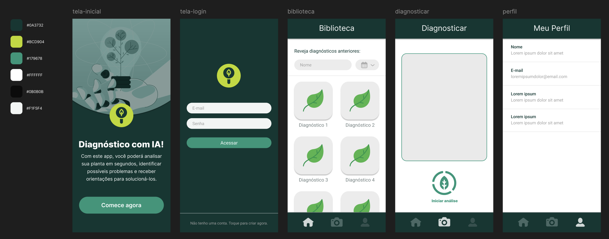
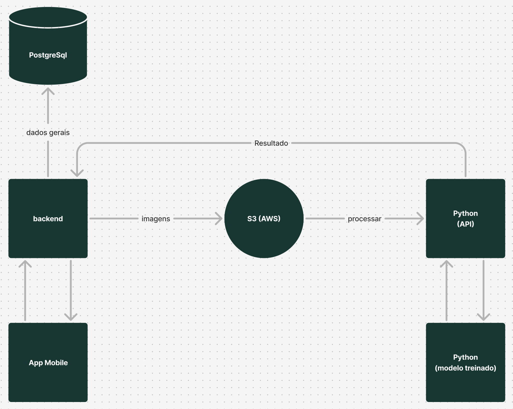

# TheSoftware+

## Projetos:
### 🌿 App de Identificação de Doenças de Plantas 
Este projeto é um aplicativo mobile que utiliza **Inteligência Artificial** para identificar doenças em plantas a partir da câmera do dispositivo. O objetivo é ajudar produtores agrícolas e pessoas interessadas, permitindo a detecção precoce de doenças e indicando um tratamento adequado.

---

#### Tecnologias Utilizadas  

- **Frontend**: Ionic + Angular  
- **Backend**: Spring + Java  
- **IA**: Python
- **Banco de Dados**: Postgresql
- **Cloud**: AWS

---

#### 🎨 Protótipo no Figma  
🔗 [Acesse o protótipo aqui](https://www.figma.com/design/0V0tEjElhEkmL7PEeEet0f/app-diagnostico-planta?t=Zk1mLzVhl9V5NFlz-1)  

---

#### 🏗 Arquitetura do Software  

A arquitetura do sistema segue um modelo **cliente-servidor**, onde o aplicativo móvel coleta imagens da câmera e envia para o backend processar e classificar as doenças usando um modelo de **Inteligência Artificial**.  

##### **Diagrama da Arquitetura**  

#### **Componentes principais:**  
##### App Mobile (Ionic + Angular)
- Captura imagens da câmera em tempo real
- Envia imagens para o AWS S3 para armazenamento
- Faz requisições ao backend Flask para análise das imagens
- Gerencia usuários através do backend Spring Boot
- Exibe os resultados de classificação e histórico de análises

##### Backend de Usuários (Java Spring Boot + PostgreSQL)
- Gerencia CRUD de usuários e autenticação
- Armazena os históricos de diagnósticos dos usuários
- Expõe APIs para o app consumir dados de usuários e históricos

##### Armazenamento de Imagens (AWS S3)
- As imagens capturadas pelo app são enviadas diretamente para o S3
- Gera URLs públicas ou assinadas para recuperação das imagens

##### Backend de Processamento de IA (Flask + TensorFlow)
- Recebe a URL da imagem no S3
- Baixa a imagem e processa utilizando CNN
- Retorna o diagnóstico para o aplicativo móvel através do Backend
